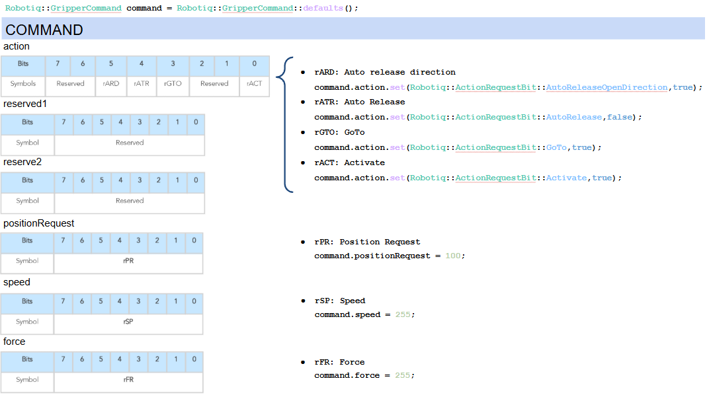
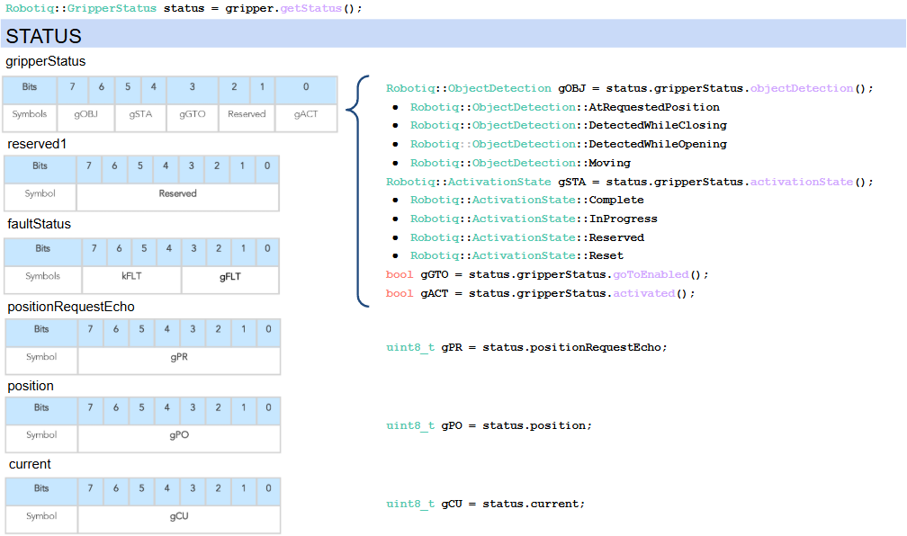
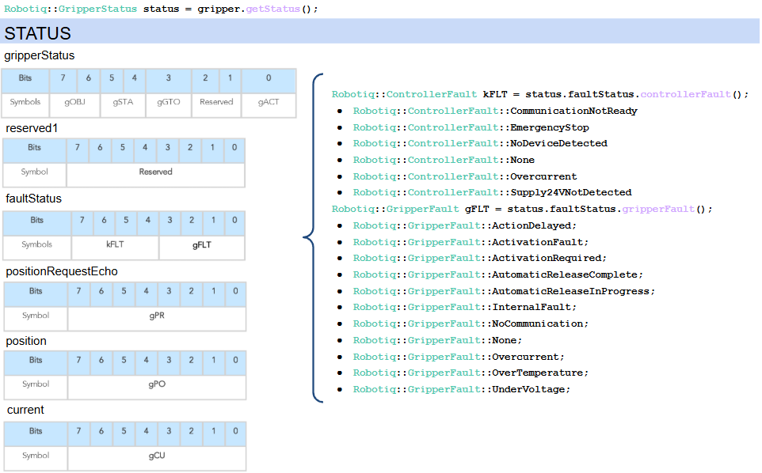

# Introduction to Gripper control

Robotiq grippers are controlled by writing commands to, and reading status from, their memory. The memory read and write is done using Modbus RTU.

## Command (Holding registers 1000 - 1002)

The registers used to command the gripper are composed of 3 registers of 16 bits. Each register is split into 2 bytes (8 bits), for a total of 6 bytes.



The positionRequest, speed and force bytes are unsigned integers coded on 8 bits, with a value in the range 0-255.

The action byte is composed of several bits, each with a dedicated function. The bits that make up the action byte are set using the `set` function. Bits are identified using the enum `Robotiq::ActionRequestBit`.

## Status (Input registers 2000 - 2002)

The registers used to retrieve the status of the gripper are composed of 3 registers of 16 bits. Each register is split into 2 bytes (8 bits), for a total of 6 bytes.





The positionRequestEcho, position and current bytes are unsigned integers coded on 8 bits, with a value in the range 0-255.

The gripperStatus and faultStatus bytes are composed of several bits that each hold specific information about the gripper status. Some information, like gGTO, is coded on 1 bit, while others, like gOBJ or gFLT, are coded on several bits. Information coded on 1 bit is boolean, while multi-bit information decodes to an enum.

## Gripper-related functions

`Gripper`'s own methods — `setCommand()`, `getStatus()`, `getCommand()`,
`connectionState()` — always return instantly: they only read or write
an in-memory snapshot, never touch the bus themselves. A few operations
need to poll and block instead, until some condition is met or a
timeout elapses; those are deliberately kept as free functions taking a
`Gripper&`, not methods, so it's obvious from the call site which calls
can block and which can't.

### Waiting for a condition

`waitFor()` (and `waitUntil()`, which takes a deadline instead of a
timeout) polls a predicate until it becomes true or the timeout
elapses:

```cpp
bool settled = Robotiq::waitFor(
    [&]{ return gripper.getStatus().gripperStatus.objectDetection() != Robotiq::ObjectDetection::Moving; },
    10s);
```

It returns `true` if the condition held before the timeout, `false`
otherwise — the condition is checked at least once, so an already-true
condition never reports a timeout.

### Activating the gripper

Before sending motion commands, the gripper must be activated once.
`activate()` is a blocking function that runs the activation handshake
(or waits out one already in progress):

```cpp
Robotiq::ActivationResult result = Robotiq::activate(gripper);
```

| `ActivationResult` | Meaning |
|---|---|
| `Activated` | the handshake ran (or one already in progress finished); the gripper is ready |
| `AlreadyActive` | already activated and fault-free; `activate()` did nothing |
| `FaultLatched` | a major fault is latched; `activate()` refuses to reset it — call `recoverFromFault()` instead |
| `Timeout` | the link stayed down, or the handshake never completed in time |

Calling `activate()` on an already-activated gripper is safe and a
no-op, so it's fine to call it at the start of every run rather than
tracking activation state yourself.

### Recovering from a fault

If `activate()` returns `FaultLatched`, or a `Major` fault shows up
later during operation (see [Error handling](#error-handling) below),
call `Robotiq::recoverFromFault()`:

```cpp
Robotiq::ActivationResult result = Robotiq::recoverFromFault(gripper);
```

`recoverFromFault()` clears the activation bit (rACT) — which resets
the gripper and clears its fault status — then sets it back to rerun
the activation handshake, blocking until it completes.

> **Warning:** this releases any grip and sweeps the fingers through
> their full range.

## Error handling

Constructing a `Gripper` can throw:
- `SerialIOException` — the serial port could not be opened or configured.
- `DriverException` — no gripper answered the initial read, or the
  connection configuration (e.g. `connectionFrequency`) is invalid.

### Checking fault severity

Not every fault needs recovery. `Robotiq::severity()` classifies the
raw fault code from `status.faultStatus` into a `FaultSeverity`:

```cpp
Robotiq::FaultStatus fault = gripper.getStatus().faultStatus;
if (Robotiq::severity(fault.gripperFault()) == Robotiq::FaultSeverity::Major)
{
    Robotiq::recoverFromFault(gripper);
}
```

| `FaultSeverity` | Meaning |
|---|---|
| `None` | no fault |
| `Warning` | informational; clears on its own |
| `Minor` | degraded operation; clears on its own |
| `Major` | needs a reset (rACT rising edge) to clear — call [`recoverFromFault()`](#recovering-from-a-fault) |

### Discard nothing

`activate()`, `recoverFromFault()`, and `waitFor()`/`waitUntil()` are
all marked `[[nodiscard]]` — their result must be checked and acted on,
since silently discarding it hides a `FaultLatched` gripper or a
timed-out wait.

## Control method

The communication flow to control the gripper is typically the following:
- Build a command
- Send the command to the gripper
- Wait for the gripper to acknowledge the command
- Wait for the gripper to complete the action
- Check final status

```cpp
// Build command
Robotiq::GripperCommand command = Robotiq::GripperCommand::defaults();
command.action.set(Robotiq::ActionRequestBit::GoTo);
command.positionRequest = 100;
command.speed = 255;
command.force = 255;

// Send command
gripper.setCommand(command);

// Wait for acknowledge
bool positionRequestEchoed = Robotiq::waitFor([&]{return gripper.getStatus().positionRequestEcho == command.positionRequest;},1s);

// Wait for action to complete
bool motionCompleted = Robotiq::waitFor([&]{return (gripper.getStatus().gripperStatus.objectDetection() != Robotiq::ObjectDetection::Moving);},10s);

// Check final status
uint8_t currentPosition = gripper.getStatus().position;
```

## How the C++ driver handles communication with the gripper

The C++ driver has been developed with the objective of maximizing communication frequency.

The `Gripper` object owns a background thread that continuously exchanges
FC 0x17 Modbus (read&write) transactions with the gripper — up to ~200 Hz at 115200 baud. That thread is the only thing that directly communicates with the gripper.

## Logging

`Gripper`'s constructor takes an optional `logger` parameter (a
`std::shared_ptr<Robotiq::Logger>`). Passing nothing, or explicitly
`nullptr`, doesn't disable logging — it falls back to the SDK's own
default logger: `StderrLogger` on a hosted build, a do-nothing
`NullLogger` on a freestanding target with no console.

```cpp
auto logger = std::make_shared<Robotiq::StderrLogger>();
Robotiq::Gripper gripper(config, logger);
```

`Logger` is a one-method interface — `log(Level, message)` — with four severities:

| `Logger::Level` | Meaning |
|---|---|
| `Debug` | high-frequency, diagnostic detail |
| `Info` | normal operational events |
| `Warn` | recoverable, but worth a human's attention |
| `Error` | an operation failed |

The background exchange thread (above) uses this same logger to report
its own health, independently of anything your own code does:
- `Warn` when several consecutive exchanges fail — the same moment
  `connectionState()` switches to `ConnectionState::Faulted`, meaning
  the process image `getStatus()` returns is now stale.
- `Info` when the link recovers and `connectionState()` returns to
  `Operational`.

Passing your own `Logger` (e.g. one that forwards to `rclcpp` in a
ROS 2 node, or writes to a UART on an embedded target) lets you route
these lines — and your own application's — through one sink instead of
two independently-timed sources that could interleave confusingly, the
same pattern
[`move_gripper.cpp` uses](4-Robust%20example%20walkthrough.md#sharing-one-logger)
for its own narration.