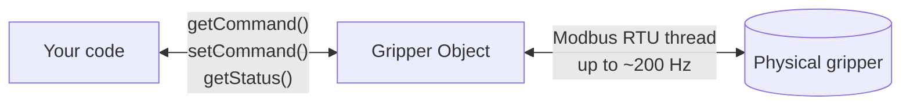
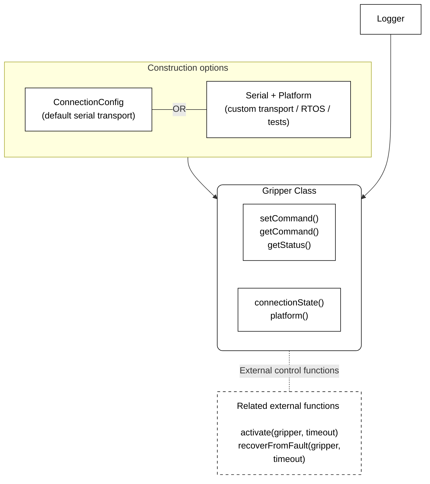
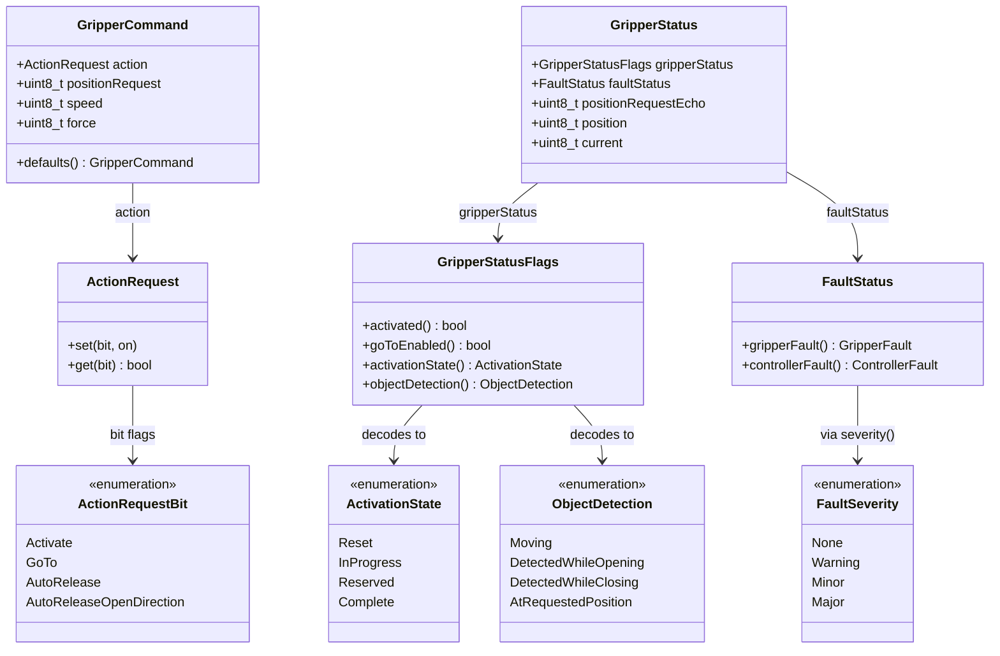

# Introduction to Robotiq Gripper control mechanism

Robotiq grippers are controlled writting command and retreive status from its memory. The memory read and write is done using Modbus RTU.

Here below is an overview of gripper registers:

...

Once the gripper get receive a command, the command is executed until complete or until a different command is received.

The basic usage of the gripper consist in sending command and monitor the status to follow the execution. In such usage the frequency of the commands send to the gripper is typically low while the status retrieve frequency can be quite high.
This is a kind of 1 time command. We request the gripper complete the stask and we let the gripper to complete it.

There are case like realtime control where commands are sent at high frequency. In such situation, the gripper is constantly interrupted in its action to fit with the always changing command.
Realtime control is use in application such as teleoperation.

# How works the C++ driver
The c++ driver have been developed with the objective to maximize communication frequency.

The `Gripper` object owns a background thread that continuously exchanges
FC 0x17 Modbus (read&write) transaction with the gripper — up to ~200 Hz at 115200 baud. That thread is the only thing that directly communicate with the gripper.


The `getCommand()`, `setCommand()` and `getStatus()` methods of the `Gripper` object are used to pass command or retrieve status from the thread. Look at API documentation for details



> **Note**
> The exchange thread's Modbus protocol layer is
> [nanoMODBUS](https://github.com/debevv/nanoMODBUS); on desktop, its
> serial transport is [libserialport](https://sigrok.org/wiki/Libserialport).

## Gripper class structure

A `Gripper` object is build from a `ConnectionConfig` object and a `Logger` object. The `ConnectionConfig` set the serial port, baudrate and communication frequency while the `Logger` define the place where are logged gripper events.

> ** Note **
> 
>A `Gripper` object can also be build from a `serial`,`slaveAddress`,`exchangePeriod`,`platform` and `logger`. This contructor is use when deploying the gripper C++ driver on a specific platform like STM32.

`activate()` and `recoverFromFault()`are functions related to the `Gripper` class but not are not part of it.



## Command & status structure

`GripperCommand` (what you send) and `GripperStatus` (what you read
back) are plain structs — no logic, just fields. Some fields are raw
numbers you set/read directly; the packed ones decode through a small
typed accessor into an enum (dashed, below), so you're never comparing
against a raw byte value yourself:

**GripperCommand**

| positionRequest | speed | force | action |
|---|---|---|---|
| Integer <br> [0 ; 255] | Integer <br> [0 ; 255] | Integer <br> [0 ; 255] | Enum (ActionRequestBit):<ul><li>Activate</li><li>GoTo</li><li>AutoRelease</li><li>AutoReleaseOpenDirection</li></ul> |

**GripperStatus**

| positionRequestEcho | position | current | gripperStatus | faultStatus |
|---|---|---|---|---|
| Integer <br> [0 ; 255] | Integer <br> [0 ; 255] | Integer <br> [0 ; 255] | Enum via `activationState()`:<ul><li>Reset</li><li>InProgress</li><li>Reserved</li><li>Complete</li></ul>Enum via `objectDetection()`:<ul><li>Moving</li><li>DetectedWhileOpening</li><li>DetectedWhileClosing</li><li>AtRequestedPosition</li></ul> | Enum via `severity()`:<ul><li>None</li><li>Warning</li><li>Minor</li><li>Major</li></ul> |

The methods behind that decoding, in full:



`GripperCommand::defaults()` gives you a sensible starting point
(activated, no motion, max speed/force) instead of a zeroed struct.
`FaultStatus` decodes to two independent raw codes — `GripperFault`
(the gripper's own) and `ControllerFault` (the optional Robotiq
controller's) — pass either to `Robotiq::severity()` to get the
`FaultSeverity` above rather than interpreting the raw code yourself;
see [`fault_status.hpp`](../sdk_cpp/include/Robotiq/gripper/fault_status.hpp)
if you need the raw codes themselves. The field-by-field reference with
allowed values is in [Usage](#usage), step 4 and step 5, below.

### Setting an action bit without knowing its raw value

The gripper's instruction manual defines `action` as a single byte
where, say, bit 3 means "auto-release" and bit 4 means "release by
opening." `ActionRequestBit` names those positions as an enum instead,
so your code never has to spell out the bit itself:

```cpp
Robotiq::GripperCommand command = Robotiq::GripperCommand::defaults();
command.action.set(Robotiq::ActionRequestBit::GoTo, true);            // start moving
command.action.set(Robotiq::ActionRequestBit::AutoRelease, false);    // ...but not an emergency release
gripper.setCommand(command);
```

`.set(bit, on)` flips exactly that one bit and leaves every other bit
in `action` untouched — including `Activate`, which `defaults()`
already turned on for you. `.get(bit)` reads a bit back the same way,
if you ever need to check what a command you built is actually asking
for before sending it. Which physical bit position `GoTo` occupies is
`register_map.hpp`'s problem, not yours.

### Interpreting status without knowing its raw codes

Symmetrically, `GripperStatusFlags` and `FaultStatus` decode the raw
status bytes into the same kind of named enum, so reading status is a
matter of comparing against those names:

```cpp
Robotiq::GripperStatus status = gripper.getStatus();

const bool moveFinished =
    status.gripperStatus.activationState() == Robotiq::ActivationState::Complete
    && status.gripperStatus.objectDetection() != Robotiq::ObjectDetection::Moving;

if (Robotiq::severity(status.faultStatus.gripperFault()) == Robotiq::FaultSeverity::Major)
{
    // e.g. call Robotiq::recoverFromFault(gripper) — see step 3 below
}
```

`activationState()` and `objectDetection()` decode `gripperStatus`
into the `ActivationState`/`ObjectDetection` enums from the diagram
above, and `Robotiq::severity()` classifies whichever raw fault code
`gripperFault()`/`controllerFault()` returns into `FaultSeverity` — in
neither case do you need to know what the underlying byte values are,
only the named outcomes you're comparing against.

## Usage

The five steps every application follows, in order. Each builds on the
one before; together they're the whole flow.

### Before you start: install dependencies and configure your IDE

The SDK is a CMake project. CMake reads [`sdk_cpp/CMakeLists.txt`](../sdk_cpp/CMakeLists.txt)
to compile the SDK, find its dependencies, and link an application against
the `Robotiq::grippers` library. For a desktop build you need:

- CMake 3.16 or newer
- A C++17 compiler
- `libserialport` for the real serial connection

See [Environment setup](1-Environment%20setup.md) for installing those
dependencies per platform, bringing the SDK into your own
`CMakeLists.txt` (vendored via `add_subdirectory()`, or installed and
resolved with `find_package()`), and configuring VS Code around it.

### 1. Create a connection

```cpp
#include <Robotiq/gripper.hpp>

Robotiq::ConnectionConfig config;
config.serial.port = "/dev/ttyUSB0";   // COM3 on Windows, /dev/tty.usbserial-XXXX on macOS
```

`ConnectionConfig` just describes what to connect to: the serial link
(`config.serial` — port, baud rate) and the gripper's Modbus slave
address (`config.modbusSlaveAddress`, defaults to the factory setting,
`0x09`). Nothing opens yet — this is plain data.

`config.serial.port` is the only field above with no default — a
`SerialConfig` starts as an empty port name, so you must set it.
Everything else already has a sensible default: `baudrate` (115200,
the factory setting), `timeout` (500 ms per transaction),
`modbusSlaveAddress` (`0x09`), and `connectionFrequency` (100 Hz for
the background exchange cycle). Only override what your setup actually
needs to differ.

### 2. Create a gripper

```cpp
Robotiq::Gripper gripper(config);
```

This opens the port and starts the background exchange thread
described [above](#how-it-works). If the gripper doesn't answer,
construction throws (`SerialIOException` for a link problem,
`DriverException` for everything else) rather than handing back a
half-open object.

`Gripper`'s constructor also takes an optional `logger` parameter,
omitted here — passing nothing (or explicitly `nullptr`) doesn't
disable logging, it falls back to the SDK's own default logger (stderr
on a hosted build). You'd pass one explicitly only if your application
wants gripper log lines routed through its own logging — as
[`move_gripper.cpp`](../sdk_cpp/examples/move_gripper.cpp) does, sharing
one `Logger` between the SDK and its own narration so every line lands
on one ordered stream.

`Gripper` actually has two constructors — two separate C++ overloads
sharing the name `Gripper`, not one constructor with more optional
parameters. The compiler picks between them purely from what you pass
at the call site: a `Gripper(config)` call like the one above can only
match the `ConnectionConfig`-based overload used throughout this walkthrough.
The other overload takes a `Serial`/`Platform` pair instead of a
`ConnectionConfig`, and is what you reach for on a custom transport or a
freestanding/RTOS target with no libserialport — see
[Embedded / bare-metal builds](4-embedded-stm32-builds.md). It also happens
to have a `logger` parameter defaulting to `nullptr`, but as its *5th*
parameter rather than its 2nd — a different parameter of a different
function, not the same one.

### 3. Activate it

```cpp
Robotiq::ActivationResult result = Robotiq::activate(gripper);
```

A fresh gripper needs this once before it will move. `activate()` is a
**free function, not a method**, even though it's specifically meant
to be used with `Gripper` — it's composed entirely out of
`gripper.getStatus()` and `gripper.setCommand()` (step 4/5's instant
accessors), polling in a loop until the gripper reports ready or the
call times out. It's kept outside the class *because* it blocks: every
member of `Gripper` is guaranteed to return instantly, so a free
function is what signals "this one doesn't work like its neighbors" —
and, since it only has the same public accessors your own code has, it
has no way to accidentally hold the internal lock those accessors use
for longer than an instant, the way an equivalent member function
easily could.

If `result` is `ActivationResult::FaultLatched`, call
`Robotiq::recoverFromFault(gripper)` instead — this clears the fault
but also moves the fingers through their full range, so the SDK never
does it for you automatically.

### 4. Build and send a command

```cpp
Robotiq::GripperCommand command = Robotiq::GripperCommand::defaults();
command.positionRequest = 255;                              // fully closed
command.action.set(Robotiq::ActionRequestBit::GoTo, true);   // execute the move
gripper.setCommand(command);
```

`GripperCommand::defaults()` gives you an activated command with no
motion and maximum speed/force — the usual starting point. From there,
set the fields you care about and send it:

| Field | Type | Values | Meaning |
|---|---|---|---|
| `positionRequest` | `uint8_t` | 0 (open) – 255 (closed) | target position |
| `speed` | `uint8_t` | 0 – 255 | motion speed |
| `force` | `uint8_t` | 0 – 255 | grip force |
| `action` | `ActionRequest` (bit flags, via `.set(bit, on)`) | see below | which action bits are asserted this cycle |

`action`'s bits (`Robotiq::ActionRequestBit`):

| Bit | Meaning |
|---|---|
| `Activate` | must stay set after activation — `defaults()` already sets it; don't clear it |
| `GoTo` | execute the move to `positionRequest` |
| `AutoRelease` | automatic (emergency) release |
| `AutoReleaseOpenDirection` | with `AutoRelease` set: release by opening (vs. closing) |

Keep one `GripperCommand` around and mutate it before each send — it's
persistent state (the gripper only sees the fields you change; the rest
keep re-sending their last value), not something to rebuild from
scratch every call.

### 5. Read and interpret status

```cpp
Robotiq::GripperStatus status = gripper.getStatus();
```

| Accessor | Type | Meaning |
|---|---|---|
| `status.position` | `uint8_t` | current position, 0 (open) – 255 (closed) |
| `status.positionRequestEcho` | `uint8_t` | last `positionRequest` the gripper has acknowledged |
| `status.current` | `uint8_t` | effort proxy |
| `status.gripperStatus.activationState()` | `ActivationState` | `Reset`, `InProgress`, `Complete` (see step 3) |
| `status.gripperStatus.objectDetection()` | `ObjectDetection` | `Moving`, `DetectedWhileOpening`, `DetectedWhileClosing`, `AtRequestedPosition` |
| `status.faultStatus.gripperFault()` / `.controllerFault()` | `GripperFault` / `ControllerFault` | pass either to `Robotiq::severity()` to classify (`None`/`Warning`/`Minor`/`Major`) |

A move is done once `objectDetection()` is no longer `Moving` — not the
instant you call `setCommand()`. Check `faultStatus` (and its
`severity()`) before assuming a command succeeded; a `Major` fault
needs `recoverFromFault()` (step 3) to clear.

For a complete, runnable version of these five steps, see
[`move_gripper.cpp`](../sdk_cpp/examples/move_gripper.cpp); for how to
build and run it, see [Environment setup](1-Environment%20setup.md).

## Without a gripper

`makeFakeGripper()` returns a `Gripper` driving a fake device instead of
a serial port, for bring-up, demos and CI on machines with no hardware
attached — same five steps, skip step 1 and swap step 2:

```cpp
#include <Robotiq/gripper/fake/gripper_factory.hpp>

auto gripper = Robotiq::makeFakeGripper();   // no port opened
```

Everything above the wire is the real thing — the typed blocks, the
exchange cycle, the process image, `activate()` / `recoverFromFault()`.
The device below it is deliberately minimal: activation completes
instantly and the fingers are wherever they were last commanded to be.
There is no motion profile, no travel time, no object detection and no
fault injection.

## Design notes

The command/status block byte layout and status bit masks are
published in `Robotiq/gripper/register_map.hpp`, and the Modbus
register addresses in `Robotiq/detail/modbus_constants.hpp`, mirroring
the instruction manual — reach for these directly only below the typed
API in [Usage](#usage), e.g. a no-thread integration decoding raw bytes.
